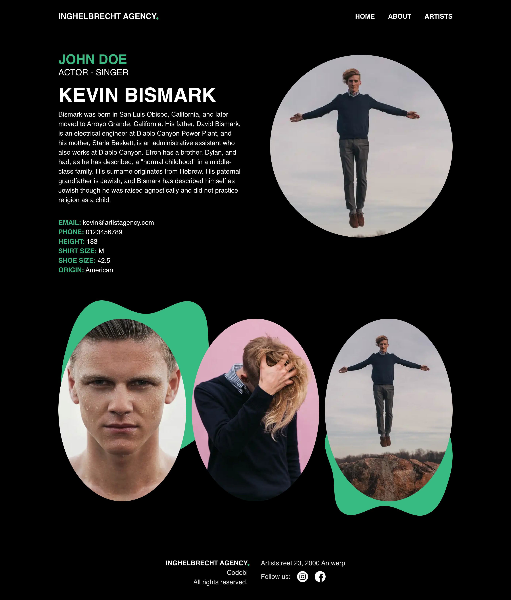

# Artist Page 🎨: opmaak en styling

## Eindresultaat:

In dit hoofdstuk zal je werken aan het hieronder weergegeven ontwerp. Zoals je kan zien wordt de Wordpress data, zowel tekst als foto's, ingeladen en in een esthetisch jasje gestoken.


**Let op** 👀: Je zal ook alle roles moeten opvragen van een artist!


