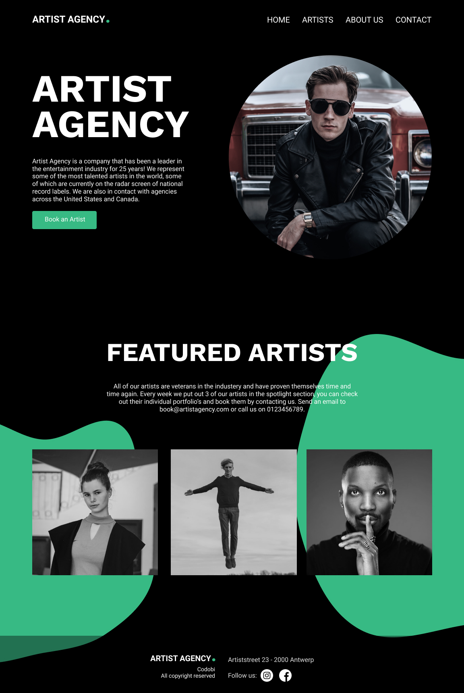

# Home page 🏠: opmaak en styling

## Eindresultaat:

In deze sectie zal je werken naar het hieronder weergegeven ontwerp. Zoals je kan zien wordt de Wordpress data, zowel tekst als foto's, ingeladen en in een esthetisch jasje gestoken.

In dit hoofdstuk beginnen we met het structureren van de JSX. Bekijk zeker nog eens de voorbeeld website en probeer zelfstandig de structuur te achterhalen.&#x20;

&#x20;[https://artist-agency-2021.netlify.app/](https://artist-agency-2021.netlify.app/)


Aangezien jullie CSS grondig hebben gezien tijdens webtechnologie, is het natuurlijk niet de bedoeling dat hier veel aandacht aan wordt besteed! De CSS zal worden aangeleverd maar niet worden uitgelegd. **Indien je interesse hebt in de opmaak van de website mag je er gerust vragen over stellen!**

