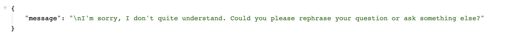

# Chiddy de AI Chatbot

Chiddy is gebouwd met het framework Next.js. Next.js is een open-source JavaScript-framework dat is ontworpen om ontwikkelaars te helpen bij het bouwen van webapplicaties. Het biedt net zoals Gatsby ondersteuning voor statische websites m.b.v. [SSG](../gatsby-frontend/static-site-generator.md). NextJS maakt gebruik van React voor het bouwen van gebruiksvriendelijke en responsieve user interfaces.

De repository op onderstaande link bevat de code voor een chatbot gemaakt met OpenAI en Next.js. Het bevat de broncode en instructies voor het opzetten en gebruiken van de chatbot. De bot beantwoordt vragen in realtime. M.a.w. er is serverside logic dat moet worden afgehandeld. Dit gebeurt met behulp van een serverless function die in de file `/pages/api` leeft.


Chiddy the AI Chatbot



Lees de `README.md` file als je het project lokaal wilt runnen.


De werking van serverless functions in Next.js is soortgelijk aan dat in Gatsby. De API-routes bevinden zich in de map `/pages/api` en Next.js maakt voor elk bestand in die map een endpoint aan gebaseerd op de filename.

In het geval van Chiddy de AI Chatbot zit er in de `/api` map één enkel bestand, namelijk `/api/question.js`. Er wordt dus een endpoint aangemaakt op `/api/question`.

Run de applicatie lokaal en spreek de endpoint aan door de volgende link in je browser url balk te kopiëren `http://localhost:3000/api/question`.

Je zal de onderstaande JSON response krijgen.

<figure><figcaption></figcaption></figure>

Je kan een POST request uitvoeren naar dit endpoint waarbij je een vraag meegeeft als `body`. De return waarde zal een AI-gegenereerd antwoord zijn. :)
